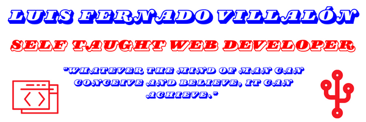

# Welcome, hope  you stay a while! 

##  About Me
My name is Luis F. Villalon, I love to challenge myself and improve myself by 1% everyday. I aspire to be employed as a Front-End/Web Developer based on my outstanding technical and interpersonal skills I have acquired and practiced. 

##   Currently Working On
<!--
**LuisFernandoVillalon/LuisFernandoVillalon** is a ✨ _special_ ✨ repository because its `README.md` (this file) appears on your GitHub profile.

Here are some ideas to get you started:

- 🔭 I’m currently working on ...
- 🌱 I’m currently learning ...
- 👯 I’m looking to collaborate on ...
- 🤔 I’m looking for help with ...
- 💬 Ask me about ...
- 📫 How to reach me: ...
- 😄 Pronouns: ...
- ⚡ Fun fact: ...
-->
