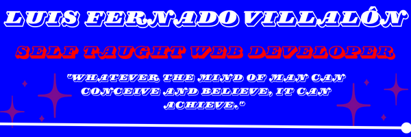

# Welcome, hope  you stay a while! 

##  About Me
My name is Luis F. Villalon, I love to challenge myself and improve myself by 1% everyday. I have been learning full stack development for three years and I am currently pursuing a B.S. in Computer Science. I am eager to make waves in the tech industry as a full-stack/software engineer.

##   Currently Working On
Actively refining my front-end and back-end development skills by creating full-stack applications. Recent projects have included a message board with full CRUD functionality with APIs I created. As well as a
photo-tagging game where the top ten records are saved. Currently attending college and will begin to develop a personal portfolio page.

##   Technologies
✍🏽 Programming Languages and Frameworks: Java, JavaScript

🖼️ Frontend Development: HTML, CSS, React.js

💾 Backend Development and Services: Node.js, Express.js, Firebase, Mongoose, MongoDB, NoSQL

👥 Version Control and Collaboration: Github

## 📫 Contact Me!
- 📧: luisfvilla012@gmail.com
- 💼: https://www.linkedin.com/in/luis-villalon/
