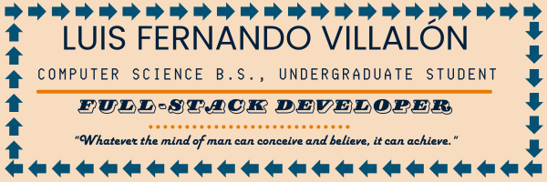

  

# Welcome, hope  you stay a while! 

##  About Me
Enthusiastic self-taught software developer with a strong foundation in JavaScript and Java. Skilled in building user interfaces with React.js and backend applications with Express.js.  Certified in Responsive Web Design and JavaScript Algorithms and Data Structures through freeCodeCamp as well as MongoDB Database Management through MongoDB.  Currently pursuing a B.S. in Computer Science to further enhance my knowledge. Eager to collaborate on projects that push the boundaries of Human-Computer Interaction (HCI), leveraging my skills to create intuitive and user-friendly experiences.

##   Currently Working On
Continuously learning:  Regularly adding assignments from my Introduction to Data Structures course to my repository to solidify my understanding of fundamental algorithms and data structures.  Building a personal portfolio website to showcase my skills and projects (link coming soon!).  Actively honing my TypeScript skills through coding exercises on Exercism.io.  Excited to embark on personal React Native projects to further enhance my mobile development capabilities.

##   Technologies
✍🏽 Programming Languages and Frameworks: Java, JavaScript

🖼️ Frontend Development: HTML, CSS, React.js

💾 Backend Development and Services: Node.js, Express.js, Firebase, Mongoose, MongoDB, NoSQL

👥 Version Control and Collaboration: Github

## 📫 Contact Me!
- 📧: luisfvilla012@gmail.com
- 💼: https://www.linkedin.com/in/luis-villalon/
