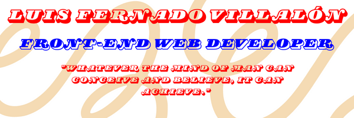

# Welcome, hope  you stay a while! 

##  About Me
My name is Luis F. Villalon, I love to challenge myself and improve myself by 1% everyday. I aspire to be employed as a Front-End/Web Developer based on my outstanding technical and interpersonal skills I have acquired and practiced. 

##   Currently Working On
Currently half-ways through the <a href="https://www.theodinproject.com/">Odin Project</a> curriculum to teach myself full-stack web development. About to begin the back-end portion of the curriculum. Just finished the final project of the JavaScript portion, which was to create a Reddit-like clone. Actively looking for employment. 

##   Technologies
- HTML
- CSS
- JavsScript
- React.js
- Firebase

##  Git Stats

## 📫 Contact Me!
- 📧: luisfvilla012@gmail.com
- 💼: https://www.linkedin.com/in/luis-villalon/
